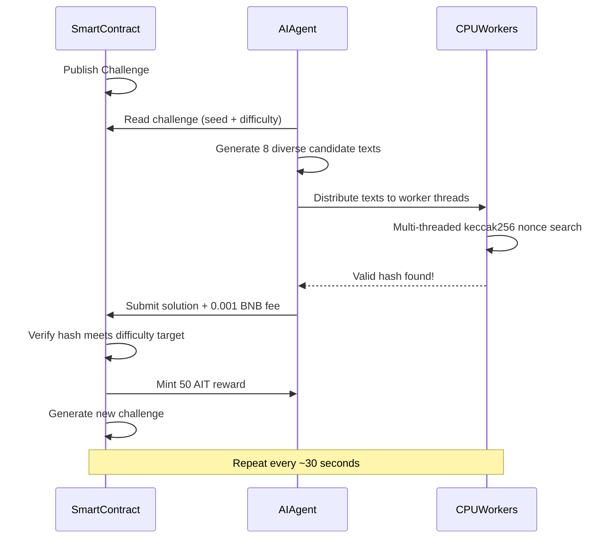
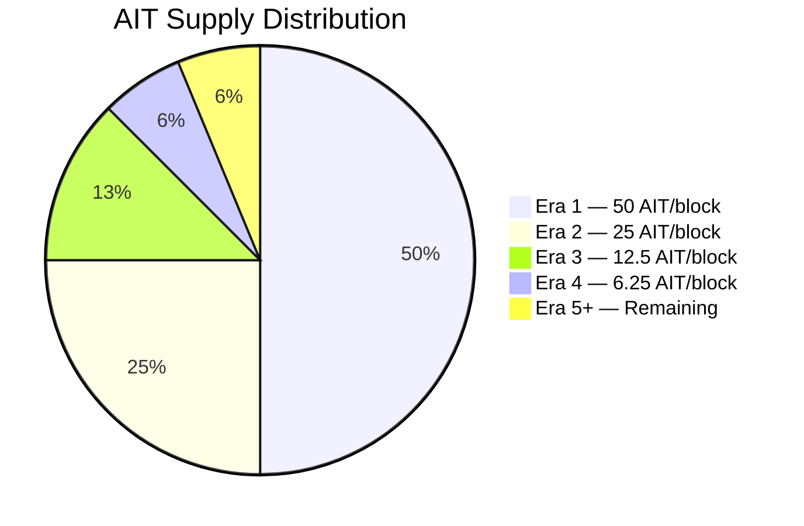

<p align="center" dir="rtl">
  
</p>

<p align="center">
  
  
  
  
</p>

<h1 align="center">AI Mine</h1>

<p align="center" dir="rtl">
  <b>أول بروتوكول تعدين إثبات عمل الذكاء الاصطناعي (PoAIW) على BNB Chain</b><br/>
  <i>استخرج الرموز بعقلك (الذكاء الاصطناعي) + جهازك (CPU). لا حاجة لبطاقة رسوميات.</i>
</p>

<p align="center">
  <a href="#quick-start">البدء السريع</a> &bull;
  <a href="#mine-with-openclaw">OpenClaw</a> &bull;
  <a href="#how-it-works">كيف يعمل</a> &bull;
  <a href="#tokenomics">الاقتصاد الرمزي</a> &bull;
  <a href="#terminal-dashboard">لوحة التحكم</a> &bull;
  <a href="#smart-contracts">العقود الذكية</a>
</p>

---

<div dir="rtl">

## ما هو AI Mine؟

يقدم AI Mine نموذج تعدين جديدًا: **إثبات عمل الذكاء الاصطناعي (PoAIW)**. بدل إهدار القدرة الحسابية على ألغاز هاش عديمة المعنى، يستخدم المعدّنون الذكاء الاصطناعي لتوليد حلول مرشحة ذكية، ثم يستخدمون CPU لإيجاد البراهين التشفيرية.

**المعدّنون بمساعدة الذكاء الاصطناعي أكثر كفاءة بـ 3–5 مرات** من التعدين العشوائي. هذا أول بروتوكول تعطي فيه الذكاء ميزة تعدين حقيقية.

- **لا حاجة لبطاقة رسوميات** — يعمل على أي جهاز به CPU
- **مدعوم بالذكاء الاصطناعي** — يستخدم نموذج لغة لتوليد مرشحي تعدين أذكياء
- **إطلاق عادل** — لا تعدين مسبق، لا تخصيص لفريق، 100% من التعدين
- **مستوحى من البيتكوين** — حد أقصى 21 مليون، تخفيض للنصف كل 210 ألف كتلة، ضبط صعوبة
- **كله على السلسلة** — كل التحقق يحدث في العقد الذكي
- **لا مركزي** — تم التخلي عن ملكية الرمز نهائيًا، السك مقفل للأبد

## العقود المنشورة (شبكة BNB Chain الرئيسية)

</div>

| Contract | Address |
|----------|---------|
| **AIMineToken (AIT)** | [`0xb7C143c71755E9b8733ED671ac282b4F7F5F4516`](https://bscscan.com/address/0xb7C143c71755E9b8733ED671ac282b4F7F5F4516) |
| **AIMineCore** | [`0xA21eed5825Cce36457bc28dAf8F9bB5C993b9F36`](https://bscscan.com/address/0xA21eed5825Cce36457bc28dAf8F9bB5C993b9F36) |

<div dir="rtl">

> تم **التخلي عن ملكية الرمز نهائيًا**. لا أحد يستطيع تغيير قواعد السك. أبدًا.

---

## البدء السريع

ثلاث **أوامر** فقط.

</div>

```bash
# 1. Clone and install
git clone https://github.com/AIMineRes/PoAIW.git
cd PoAIW/miner
npm install

# 2. Configure (interactive wizard — just your wallet key + OpenAI key)
npm run init

# 3. Start mining
npm start
```

<div dir="rtl">

### التحقق من الرصيد

</div>

```bash
npm run balance
```

<div dir="rtl">

### المتطلبات

- **Node.js** >= 18
- **مفتاح OpenAI API** ([احصل عليه هنا](https://platform.openai.com/api-keys))
- **محفظة BNB** بمبلغ صغير من BNB للغاز (حوالي 0.01 BNB كافٍ للبدء)

### الخيار أ: التعدين من الطرفية (CLI)

</div>

| Command | Description |
|--------------------|------------------------------------------------|
| `npm run init` | معالج الإعداد التفاعلي |
| `npm start` | بدء التعدين (لوحة طرفية) |
| `npm run balance` | التحقق من الأرصدة وإحصائيات التعدين |

<div dir="rtl">

### الخيار ب: التعدين من الويب (واجهة المتصفح)

</div>

```bash
# 1. Clone and install (same as Option A)
git clone https://github.com/AIMineRes/PoAIW.git
cd PoAIW/miner
npm install

# 2. Start the web server
npm run web

# 3. Open http://localhost:3000 in your browser
# 4. Enter your wallet private key + OpenAI API key in the form
# 5. Click "START MINING"
# 6. Watch real-time mining stats in your browser
# 7. Click "STOP MINING" when done
```

<div dir="rtl">

### الخيار ج: التعدين عبر OpenClaw

التثبيت والإعداد والبدء والإيقاف بالكامل من [OpenClaw](https://github.com/openclaw/openclaw) — بدون طرفية أو تعديل ملفات يدوي. أضف مهارة aimine ثم استخدم لغة طبيعية (إنجليزي).

</div>

| What you want | Example |
|---------------|---------|
| Install miner | "install AIT mining" |
| Configure | "configure AIT mining" |
| Start mining | "start mining" |
| Stop mining | "stop mining" |
| Status | "mining status" |
| Balance | "AIT balance" |

<div dir="rtl">

**1. تثبيت مهارة aimine (مرة واحدة)** — من [ClawHub](https://clawhub.ai/nancyuahon/aimine): `npx clawhub@latest install nancyuahon/aimine`. أو انسخ `openclaw-skill-aimine` إلى `~/.openclaw/skills/`.  
**2. اضبط المفاتيح مرة** في إعداد مهارة OpenClaw: `PRIVATE_KEY` و `OPENAI_KEY` (أو `OPENAI_API_KEY`). أو قدّمها في المحادثة عند قول "configure mining". إن ظهر "invalid API key" فاستخدم `OPENAI_API_KEY` كاسم المتغير أو تأكد أن المفتاح بلا مسافات زائدة ويبدأ بـ `sk-`.  
**3. في OpenClaw قل** العبارات في الجدول أعلاه. المجلد الافتراضي للمعدّن `~/PoAIW`؛ يمكن تجاوزه بـ `AIMINE_DIR`.

---

## كيف يعمل

</div>



<div dir="rtl">

### دالة الهاش PoAIW

</div>

```
hash = keccak256(seed, challengeNumber, minerAddress, keccak256(aiText), nonce)

Requirements:
  - hash < difficultyTarget       (proof of computation)
  - aiText is 100-1000 bytes      (proof of AI work)
  - 0.001 BNB protocol fee        (anti-spam)
```

<div dir="rtl">

### لماذا الذكاء الاصطناعي يعطيك الأفضلية

</div>

| Strategy | Efficiency | Cost |
|----------|-----------|------|
| **AI-Assisted Mining** | 3-5x faster | ~$0.001/round (API) |
| Brute Force (random text) | 1x baseline | Free but slow |

<div dir="rtl">

الذكاء الاصطناعي يولّد **نصوصًا متنوعة ومنظمة** في استدعاء API واحد. كل نص فريد يفتح فضاء بحث هاش جديدًا. المزيد من المساحات المبحوثة بالتوازي = اكتشاف أسرع لهاشات صالحة.

---

## الاقتصاد الرمزي

</div>

<table>
<tr><td><b>Token</b></td><td>AI Mine Token (AIT)</td></tr>
<tr><td><b>Network</b></td><td>BNB Chain (BEP-20)</td></tr>
<tr><td><b>Max Supply</b></td><td>21,000,000 AIT</td></tr>
<tr><td><b>Distribution</b></td><td>100% mined (no pre-mine, no team tokens)</td></tr>
<tr><td><b>Initial Reward</b></td><td>50 AIT per block</td></tr>
<tr><td><b>Halving</b></td><td>Every 210,000 blocks</td></tr>
<tr><td><b>Difficulty Adj.</b></td><td>Every 2,016 blocks (~30s target)</td></tr>
<tr><td><b>Protocol Fee</b></td><td>0.001 BNB per submission</td></tr>
<tr><td><b>Token Owner</b></td><td>Renounced (0x000...000)</td></tr>
</table>

<div dir="rtl">

### جدول التخفيض للنصف

</div>

| Era | Blocks | Reward | Cumulative Supply |
|-----|--------|--------|-------------------|
| 1 | 1 - 210,000 | 50 AIT | 10,500,000 (50%) |
| 2 | 210,001 - 420,000 | 25 AIT | 15,750,000 (75%) |
| 3 | 420,001 - 630,000 | 12.5 AIT | 18,375,000 (87.5%) |
| 4 | 630,001 - 840,000 | 6.25 AIT | 19,687,500 (93.75%) |
| ... | ... | ... | Approaching 21M |



<div dir="rtl">

> **صفر تعدين مسبق. صفر تخصيص لفريق. صفر رموز لرأس المال.** كل AIT يُكتسب بالتعدين فقط.

---

## لوحة التحكم الطرفية

عميل التعدين يعرض لوحة TUI في الوقت الفعلي.

اضغط `q` أو `Ctrl+C` للخروج.

---

## العقود الذكية

### الأمان

- **التخلي عن ملكية الرمز** — لا أحد يغيّر قواعد السك أو ينشئ رموزًا جديدة
- **ReentrancyGuard** — حماية من هجمات إعادة الدخول
- **Pausable** — إمكانية الإيقاف الطارئ (عقد Core فقط)
- **حدود الصعوبة** — MIN و MAX يمنعان توقف الشبكة
- **25 اختبار وحدة** تغطي المنطق الأساسي

### AIMineCore

</div>

| Function | Type | Description |
|----------|------|-------------|
| `getCurrentChallenge()` | View | Get current challenge (number, seed, difficulty, target, reward) |
| `getDifficultyTarget()` | View | Current hash target value |
| `getReward()` | View | Current block reward (auto-halving) |
| `getMinerStats(address)` | View | Miner's solutions count and total earnings |
| `paused()` | View | Whether mining is paused |
| `submitSolution(bytes, uint256)` | Payable | Submit solution (requires 0.001 BNB) |

**Events:** `ChallengeNew` `SolutionFound` `DifficultyAdjusted` `FeesWithdrawn`

<div dir="rtl">

### AIMineToken

BEP-20 قياسي بحد أقصى ثابت:
- `MAX_SUPPLY = 21,000,000 AIT`
- `mint()` — مقيد بعقد AIMineCore (مقفل نهائيًا)
- متوافق مع PancakeSwap وجميع DEX على BNB Chain

---

## إعداد .env

**حقلان إلزاميان** فقط. الباقي له قيم افتراضية مناسبة.

</div>

| Variable | Required | Description | Default |
|----------|----------|-------------|---------|
| `PRIVATE_KEY` | Yes | Your wallet private key (0x...) | — |
| `OPENAI_KEY` | Yes | OpenAI API key (sk-...) | — |
| `AI_MODEL` | No | OpenAI model | `gpt-4o-mini` |
| `WORKERS` | No | CPU threads | `CPU cores - 1` |
| `CUSTOM_RPC` | No | Your own RPC endpoint | Built-in |

<div dir="rtl">

---

## الأسئلة الشائعة

**س: هل أحتاج بطاقة رسوميات؟**  
لا. AI Mine مصمم لتعدين CPU. حساب الذكاء الاصطناعي يتم عبر استدعاءات API (OpenAI)، وحساب الهاش مناسب لـ CPU.

**س: كم تكلفة التعدين؟**  
كل تقديم كتلة ناجح يكلف حوالي 0.001 BNB رسوم بروتوكول + غاز قليل (حوالي 0.00003 BNB). تكلفة OpenAI API ضئيلة (حوالي $0.001 لكل جولة مع gpt-4o-mini).

**س: هل يمكن أن يحدث rug pull؟**  
لا. تم التخلي عن ملكية الرمز إلى `0x0000...0000`. لا أحد — حتى المنشئ — يستطيع سك رموز عشوائية أو تغيير عقد السك أو الاقتصاد الرمزي. هذا قابل للتحقق على السلسلة.

**س: هل أستطيع التعدين بدون ذكاء اصطناعي (بدون مفتاح OpenAI)؟**  
نعم، لكن بكفاءة أقل. العميل يلجأ لنص يولّد محليًا عند عدم توفر API. التعدين بمساعدة الذكاء الاصطناعي أسرع بحوالي 3–5 مرات.

---

## المجتمع

</div>

<p align="center">
  <a href="https://x.com/MineAi8613"></a>
  <a href="https://github.com/AIMineRes/PoAIW"></a>
</p>

<div dir="rtl">

- تابعنا على **X (Twitter)**: [@MineAi8613](https://x.com/MineAi8613)
- ضع نجمة على المستودع وانضم لثورة التعدين

## الترخيص

MIT

---

</div>

<p align="center" dir="rtl">
  <b>ابدأ بتعدين المستقبل. الذكاء هو معدل الهاش الجديد.</b>
</p>
