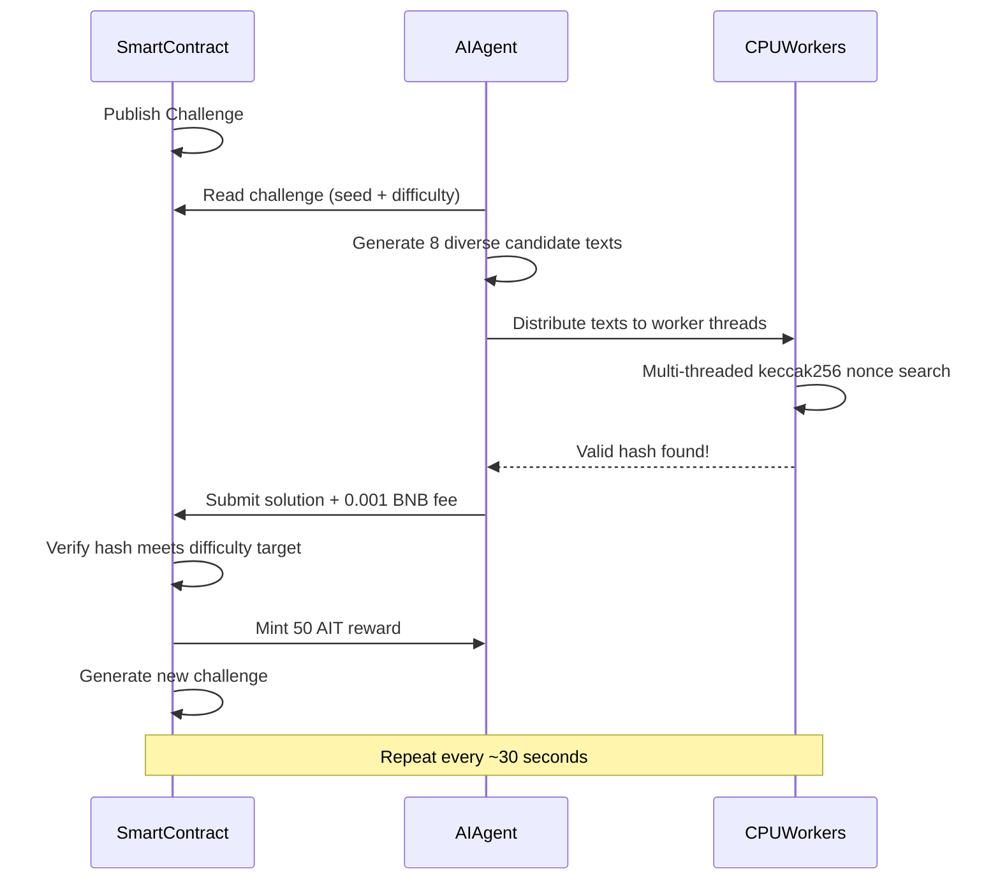
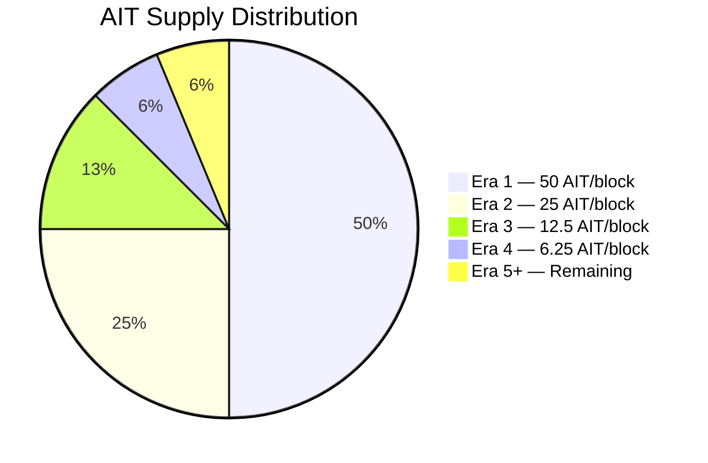

<p align="center">
  
</p>

<p align="center">
  
  
  
  
</p>

<h1 align="center">AI Mine</h1>

<p align="center">
  <b>BNB Chain 初の AI 作業証明 (PoAIW) マイニングプロトコル</b><br/>
  <i>脳（AI）とマシン（CPU）でトークンを掘る。GPU 不要。</i>
</p>

<p align="center">
  <a href="#quick-start">クイックスタート</a> &bull;
  <a href="#mine-with-openclaw">OpenClaw</a> &bull;
  <a href="#how-it-works">仕組み</a> &bull;
  <a href="#tokenomics">トークノミクス</a> &bull;
  <a href="#terminal-dashboard">ダッシュボード</a> &bull;
  <a href="#smart-contracts">スマートコントラクト</a>
</p>

---

## AI Mine とは？

AI Mine は新しいマイニングの形 **AI 作業証明 (PoAIW)** を導入します。無意味なハッシュパズルに計算資源を費やす代わりに、マイナーは AI で賢い候補解を生成し、CPU で暗号学的な証明を探します。

**AI 支援マイニングは総当たりの 3〜5 倍効率的**。知性が本当のマイニング優位になる初のプロトコルです。

- **GPU 不要** — CPU があればどこでも動作
- **AI 駆動** — LLM でスマートなマイニング候補を生成
- **フェアローンチ** — プレマインなし、チーム割当なし、100% 掘り出し
- **ビットコイン風** — 2,100万枚上限、21万ブロックごとに半減、難易度調整
- **完全オンチェーン** — 検証はすべてスマートコントラクト内
- **分散型** — トークン所有権放棄、鋳造は永久にロック

## デプロイ済みコントラクト（BNB Chain メインネット）

| コントラクト | アドレス |
|----------|---------|
| **AIMineToken (AIT)** | [`0xb7C143c71755E9b8733ED671ac282b4F7F5F4516`](https://bscscan.com/address/0xb7C143c71755E9b8733ED671ac282b4F7F5F4516) |
| **AIMineCore** | [`0xA21eed5825Cce36457bc28dAf8F9bB5C993b9F36`](https://bscscan.com/address/0xA21eed5825Cce36457bc28dAf8F9bB5C993b9F36) |

> トークン所有権は**永久に放棄**済み。鋳造ルールを変更できる者は誰もいません。

---

## クイックスタート

**3 コマンド**で始められます。

```bash
# 1. クローンとインストール
git clone https://github.com/AIMineRes/PoAIW.git
cd PoAIW/miner
npm install

# 2. 設定（対話式ウィザード — ウォレット鍵 + OpenAI キーだけ）
npm run init

# 3. マイニング開始
npm start
```

### 残高確認

```bash
npm run balance
```

### 前提条件

- **Node.js** >= 18
- **OpenAI API キー**（[こちらで取得](https://platform.openai.com/api-keys)）
- **BNB ウォレット**（少量の BNB で gas 用、約 0.01 BNB で十分）

### 方法 A: ターミナルマイニング (CLI)

| コマンド | 説明 |
|--------------------|------------------------------------------------|
| `npm run init` | 対話式セットアップ |
| `npm start` | マイニング開始（ターミナルダッシュボード） |
| `npm run balance` | ウォレット残高・マイニング統計の確認 |

### 方法 B: Web マイニング（ブラウザ UI）

```bash
# 1. クローン・インストール（方法 A と同じ）
git clone https://github.com/AIMineRes/PoAIW.git
cd PoAIW/miner
npm install

# 2. Web サーバー起動
npm run web

# 3. ブラウザで http://localhost:3000 を開く
# 4. フォームにウォレット秘密鍵と OpenAI API キーを入力
# 5. 「START MINING」をクリック
# 6. ブラウザでリアルタイム統計を確認
# 7. 終了時は「STOP MINING」をクリック
```

### 方法 C: OpenClaw でマイニング

[OpenClaw](https://github.com/openclaw/openclaw) からインストール・設定・開始・停止まで行えます。ターミナルや手動編集は不要。aimine スキルを入れたら自然言語（英語）で操作できます。

| やりたいこと | 例 |
|---------------|---------|
| マイナーをインストール | "install AIT mining" |
| 設定 | "configure AIT mining" |
| マイニング開始 | "start mining" |
| マイニング停止 | "stop mining" |
| 状態 | "mining status" |
| 残高 | "AIT balance" |

**1. aimine スキルをインストール（1回のみ）** — [ClawHub](https://clawhub.ai/nancyuahon/aimine): `npx clawhub@latest install nancyuahon/aimine`。または `openclaw-skill-aimine` を `~/.openclaw/skills/` にコピー。  
**2. OpenClaw のスキル設定で** `PRIVATE_KEY` と `OPENAI_KEY`（または `OPENAI_API_KEY`）を一度設定。または「configure mining」と言ったときにチャットで渡す。invalid API key の場合は `OPENAI_API_KEY` を変数名にするか、キーに余分なスペースがなく `sk-` で始まるか確認。  
**3. OpenClaw で**上表の英語フレーズを話すだけ。マイナーディレクトリはデフォルト `~/PoAIW`。`AIMINE_DIR` で上書き可能。

---

## 仕組み



### PoAIW ハッシュ関数

```
hash = keccak256(seed, challengeNumber, minerAddress, keccak256(aiText), nonce)

要件:
  - hash < difficultyTarget       （計算の証明）
  - aiText は 100–1000 バイト    （AI 作業の証明）
  - 提出ごとに 0.001 BNB 手数料  （スパム防止）
```

### AI が有利な理由

| 戦略 | 効率 | コスト |
|----------|-----------|------|
| **AI 支援マイニング** | 約 3〜5 倍速い | 約 $0.001/ラウンド (API) |
| 総当たり（ランダムテキスト） | 1x ベースライン | 無料だが遅い |

AI は 1 回の API 呼び出しで**多様で構造化されたテキスト**を生成します。テキストごとに新しいハッシュ探索空間が開き、並列に探索する空間が増えるほど有効なハッシュを早く見つけられます。

---

## トークノミクス

<table>
<tr><td><b>トークン</b></td><td>AI Mine Token (AIT)</td></tr>
<tr><td><b>ネットワーク</b></td><td>BNB Chain (BEP-20)</td></tr>
<tr><td><b>最大供給</b></td><td>21,000,000 AIT</td></tr>
<tr><td><b>分配</b></td><td>100% 掘り出し（プレマイン・チームトークンなし）</td></tr>
<tr><td><b>初期報酬</b></td><td>ブロックあたり 50 AIT</td></tr>
<tr><td><b>半減</b></td><td>21万ブロックごと</td></tr>
<tr><td><b>難易度調整</b></td><td>2,016 ブロックごと（約30秒目標）</td></tr>
<tr><td><b>プロトコル手数料</b></td><td>提出ごとに 0.001 BNB</td></tr>
<tr><td><b>トークン所有者</b></td><td>放棄済み (0x000...000)</td></tr>
</table>

### 半減スケジュール

| 時代 | ブロック | 報酬 | 累計供給 |
|-----|--------|--------|-------------------|
| 1 | 1 - 210,000 | 50 AIT | 10,500,000 (50%) |
| 2 | 210,001 - 420,000 | 25 AIT | 15,750,000 (75%) |
| 3 | 420,001 - 630,000 | 12.5 AIT | 18,375,000 (87.5%) |
| 4 | 630,001 - 840,000 | 6.25 AIT | 19,687,500 (93.75%) |
| ... | ... | ... | 21M に漸近 |

### トークン分配



> **プレマインゼロ。チーム割当ゼロ。VC トークンゼロ。** すべての AIT はマイニングで獲得。

---

## ターミナルダッシュボード

マイニングクライアントはリアルタイム TUI を搭載しています。

`q` または `Ctrl+C` で終了。

---

## スマートコントラクト

### セキュリティ

- **トークン所有権放棄** — 鋳造ルールや新規発行を変更する者なし
- **ReentrancyGuard** — リエントランシー対策
- **Pausable** — 緊急停止（Core コントラクトのみ）
- **難易度上下限** — ネットワークの停止を防止
- **25 単体テスト** でコアロジックをカバー

### AIMineCore

| 関数 | 種類 | 説明 |
|----------|------|-------------|
| `getCurrentChallenge()` | View | 現在のチャレンジ（番号、シード、難易度、ターゲット、報酬） |
| `getDifficultyTarget()` | View | 現在のハッシュターゲット |
| `getReward()` | View | 現在のブロック報酬（自動半減） |
| `getMinerStats(address)` | View | マイナーの解答数と総収益 |
| `paused()` | View | マイニング停止中か |
| `submitSolution(bytes, uint256)` | Payable | 解の提出（0.001 BNB 必要） |

**イベント:** `ChallengeNew` `SolutionFound` `DifficultyAdjusted` `FeesWithdrawn`

### AIMineToken

標準 BEP-20、ハードキャップ:
- `MAX_SUPPLY = 21,000,000 AIT`
- `mint()` — AIMineCore コントラクトに限定（永久ロック）
- PancakeSwap および BNB Chain の全 DEX と互換

---

## .env 設定

**必須は 2 項目**。それ以外は適切なデフォルトあり。

| 変数 | 必須 | 説明 | デフォルト |
|----------|----------|-------------|---------|
| `PRIVATE_KEY` | はい | ウォレット秘密鍵 (0x...) | — |
| `OPENAI_KEY` | はい | OpenAI API キー (sk-...) | — |
| `AI_MODEL` | いいえ | OpenAI モデル | `gpt-4o-mini` |
| `WORKERS` | いいえ | CPU スレッド数 | コア数 - 1 |
| `CUSTOM_RPC` | いいえ | 自前 RPC | 組み込み |

---

## よくある質問

**Q: GPU は必要ですか？**  
いいえ。AI Mine は CPU マイニング用です。AI 部分は API（OpenAI）で実行され、ハッシュ計算は CPU で十分です。

**Q: マイニングのコストは？**  
成功したブロック提出ごとに約 0.001 BNB のプロトコル手数料とわずかな gas（約 0.00003 BNB）。OpenAI API は gpt-4o-mini で約 $0.001/ラウンドと低コストです。

**Q: ラグプル（rug pull）の心配は？**  
ありません。トークン所有権は `0x0000...0000` に放棄済み。デプロイヤー含め誰も任意に鋳造したり鋳造コントラクトやトークノミクスを変更できません。オンチェーンで確認できます。

**Q: OpenAI キーがなくても掘れますか？**  
はい。効率は落ちます。API が使えないときはローカル生成テキストにフォールバックします。AI 支援マイニングは約 3〜5 倍速いです。

---

## コミュニティ

<p align="center">
  <a href="https://x.com/MineAi8613"></a>
  <a href="https://github.com/AIMineRes/PoAIW"></a>
</p>

- **X (Twitter)**: [@MineAi8613](https://x.com/MineAi8613)
- リポジトリをスターして、マイニング革命に参加しよう

## ライセンス

MIT

---

<p align="center">
  <b>未来を掘れ。知性が新しいハッシュレートだ。</b>
</p>
