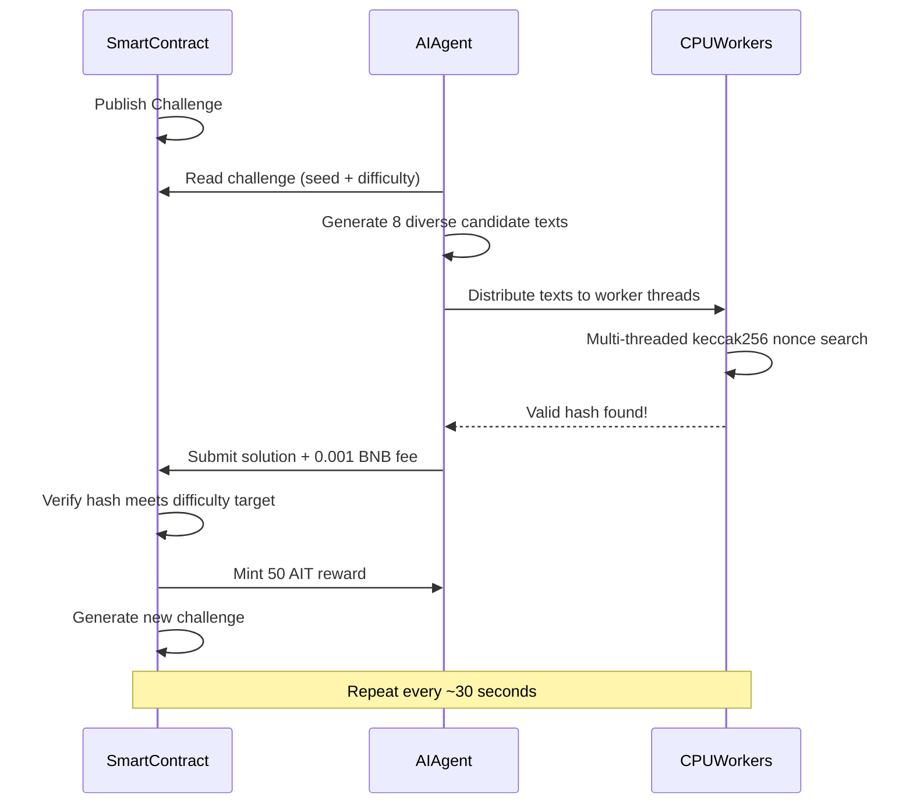
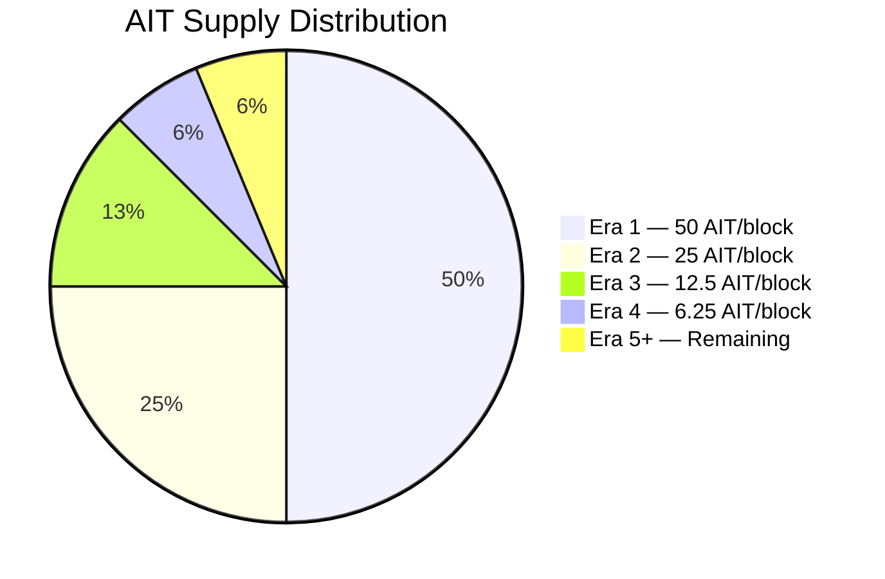

<p align="center">
  
</p>

<p align="center">
  
  
  
  
</p>

<h1 align="center">AI Mine</h1>

<p align="center">
  <b>BNB Chain 최초 AI 작업 증명(PoAIW) 마이닝 프로토콜</b><br/>
  <i>뇌(AI)와 머신(CPU)으로 채굴. GPU 불필요.</i>
</p>

<p align="center">
  <a href="#quick-start">빠른 시작</a> &bull;
  <a href="#mine-with-openclaw">OpenClaw</a> &bull;
  <a href="#how-it-works">작동 방식</a> &bull;
  <a href="#tokenomics">토크노믹스</a> &bull;
  <a href="#terminal-dashboard">대시보드</a> &bull;
  <a href="#smart-contracts">스마트 컨트랙트</a>
</p>

---

## AI Mine이란?

AI Mine은 새로운 채굴 패러다임 **AI 작업 증명(PoAIW)**을 도입합니다. 무의미한 해시 퍼즐에 연산을 낭비하는 대신, 채굴자는 AI로 지능형 후보 해를 생성하고 CPU로 암호학적 검증을 수행합니다.

**AI 보조 채굴은 무차별 대입 대비 3~5배 효율적**이며, 지능이 실제 채굴 이점이 되는 최초의 프로토콜입니다.

- **GPU 불필요** — CPU만 있으면 어디서든 실행
- **AI 기반** — LLM으로 스마트 채굴 후보 생성
- **공정 런치** — 사전 채굴·팀 할당 없음, 100% 채굴 배분
- **비트코인 스타일** — 2,100만 한도, 21만 블록마다 반감, 난이도 조정
- **완전 온체인** — 검증은 모두 스마트 컨트랙트에서 수행
- **탈중앙화** — 토큰 소유권 포기, 발행 규칙 영구 고정

## 배포된 컨트랙트 (BNB Chain 메인넷)

| 컨트랙트 | 주소 |
|----------|---------|
| **AIMineToken (AIT)** | [`0xb7C143c71755E9b8733ED671ac282b4F7F5F4516`](https://bscscan.com/address/0xb7C143c71755E9b8733ED671ac282b4F7F5F4516) |
| **AIMineCore** | [`0xA21eed5825Cce36457bc28dAf8F9bB5C993b9F36`](https://bscscan.com/address/0xA21eed5825Cce36457bc28dAf8F9bB5C993b9F36) |

> 토큰 소유권은 **영구적으로 포기**되었습니다. 발행 규칙을 바꿀 수 있는 사람은 없습니다.

---

## 빠른 시작

**3개 명령**이면 됩니다.

```bash
# 1. 클론 및 설치
git clone https://github.com/AIMineRes/PoAIW.git
cd PoAIW/miner
npm install

# 2. 설정 (대화형 마법사 — 지갑 키 + OpenAI 키만)
npm run init

# 3. 채굴 시작
npm start
```

### 잔액 확인

```bash
npm run balance
```

### 사전 요구사항

- **Node.js** >= 18
- **OpenAI API 키** ([여기서 발급](https://platform.openai.com/api-keys))
- **BNB 지갑** (가스용 소량 BNB, 약 0.01 BNB면 충분)

### 방법 A: 터미널 채굴 (CLI)

| 명령 | 설명 |
|--------------------|------------------------------------------------|
| `npm run init` | 대화형 설정 마법사 |
| `npm start` | 채굴 시작 (터미널 대시보드) |
| `npm run balance` | 지갑 잔액 및 채굴 통계 확인 |

### 방법 B: 웹 채굴 (브라우저 UI)

```bash
# 1. 클론·설치 (방법 A와 동일)
git clone https://github.com/AIMineRes/PoAIW.git
cd PoAIW/miner
npm install

# 2. 웹 서버 실행
npm run web

# 3. 브라우저에서 http://localhost:3000 열기
# 4. 폼에 지갑 개인키 + OpenAI API 키 입력
# 5. "START MINING" 클릭
# 6. 브라우저에서 실시간 채굴 통계 확인
# 7. 완료 시 "STOP MINING" 클릭
```

### 방법 C: OpenClaw로 채굴

[OpenClaw](https://github.com/openclaw/openclaw)에서 설치·설정·시작·중지를 모두 처리합니다. 터미널이나 수동 파일 수정 불필요. aimine 스킬을 추가한 뒤 자연어(영어)로 조작할 수 있습니다.

| 하고 싶은 것 | 예시 |
|---------------|---------|
| 채굴기 설치 | "install AIT mining" |
| 설정 | "configure AIT mining" |
| 채굴 시작 | "start mining" |
| 채굴 중지 | "stop mining" |
| 상태 | "mining status" |
| 잔액 | "AIT balance" |

**1. aimine 스킬 설치 (1회)** — [ClawHub](https://clawhub.ai/nancyuahon/aimine): `npx clawhub@latest install nancyuahon/aimine`. 또는 `openclaw-skill-aimine`을 `~/.openclaw/skills/`에 복사.  
**2. OpenClaw 스킬 설정에서** `PRIVATE_KEY`와 `OPENAI_KEY`(또는 `OPENAI_API_KEY`)를 한 번 설정. 또는 "configure mining"이라고 할 때 채팅으로 전달. invalid API key가 나오면 `OPENAI_API_KEY`를 환경 변수명으로 쓰거나, 키에 공백이 없고 `sk-`로 시작하는지 확인.  
**3. OpenClaw에서** 위 표의 영어 문구를 말하면 됩니다. 채굴기 디렉터리 기본값은 `~/PoAIW`. `AIMINE_DIR`로 덮어쓸 수 있습니다.

---

## 작동 방식



### PoAIW 해시 함수

```
hash = keccak256(seed, challengeNumber, minerAddress, keccak256(aiText), nonce)

요건:
  - hash < difficultyTarget       (연산 증명)
  - aiText 100–1000 바이트       (AI 작업 증명)
  - 제출당 0.001 BNB 수수료      (스팸 방지)
```

### AI가 유리한 이유

| 전략 | 효율 | 비용 |
|----------|-----------|------|
| **AI 보조 채굴** | 약 3~5배 빠름 | 약 $0.001/라운드 (API) |
| 무차별 대입(랜덤 텍스트) | 1x 기준 | 무료지만 느림 |

AI는 한 번의 API 호출로 **다양하고 구조화된 텍스트**를 생성합니다. 텍스트마다 새로운 해시 탐색 공간이 열리고, 병렬로 탐색하는 공간이 많을수록 유효한 해시를 더 빨리 찾습니다.

---

## 토크노믹스

<table>
<tr><td><b>토큰</b></td><td>AI Mine Token (AIT)</td></tr>
<tr><td><b>네트워크</b></td><td>BNB Chain (BEP-20)</td></tr>
<tr><td><b>최대 공급</b></td><td>21,000,000 AIT</td></tr>
<tr><td><b>배분</b></td><td>100% 채굴 (사전 채굴·팀 토큰 없음)</td></tr>
<tr><td><b>초기 보상</b></td><td>블록당 50 AIT</td></tr>
<tr><td><b>반감</b></td><td>21만 블록마다</td></tr>
<tr><td><b>난이도 조정</b></td><td>2,016 블록마다 (약 30초 목표)</td></tr>
<tr><td><b>프로토콜 수수료</b></td><td>제출당 0.001 BNB</td></tr>
<tr><td><b>토큰 소유자</b></td><td>포기됨 (0x000...000)</td></tr>
</table>

### 반감 일정

| 시대 | 블록 | 보상 | 누적 공급 |
|-----|--------|--------|-------------------|
| 1 | 1 - 210,000 | 50 AIT | 10,500,000 (50%) |
| 2 | 210,001 - 420,000 | 25 AIT | 15,750,000 (75%) |
| 3 | 420,001 - 630,000 | 12.5 AIT | 18,375,000 (87.5%) |
| 4 | 630,001 - 840,000 | 6.25 AIT | 19,687,500 (93.75%) |
| ... | ... | ... | 21M에 수렴 |

### 토큰 배분



> **사전 채굴 없음. 팀 할당 없음. VC 토큰 없음.** 모든 AIT는 채굴로만 획득.

---

## 터미널 대시보드

채굴 클라이언트는 실시간 TUI를 제공합니다.

`q` 또는 `Ctrl+C`로 종료.

---

## 스마트 컨트랙트

### 보안

- **토큰 소유권 포기** — 발행 규칙 변경·신규 발행 불가
- **ReentrancyGuard** — 재진입 공격 방지
- **Pausable** — 비상 정지 (Core 컨트랙트만)
- **난이도 상·하한** — 네트워크 정체 방지
- **25개 단위 테스트**로 핵심 로직 커버

### AIMineCore

| 함수 | 유형 | 설명 |
|----------|------|-------------|
| `getCurrentChallenge()` | View | 현재 챌린지(번호, 시드, 난이도, 타깃, 보상) |
| `getDifficultyTarget()` | View | 현재 해시 타깃 값 |
| `getReward()` | View | 현재 블록 보상(자동 반감) |
| `getMinerStats(address)` | View | 채굴자 해답 수 및 총 수익 |
| `paused()` | View | 채굴 일시정지 여부 |
| `submitSolution(bytes, uint256)` | Payable | 해 제출 (0.001 BNB 필요) |

**이벤트:** `ChallengeNew` `SolutionFound` `DifficultyAdjusted` `FeesWithdrawn`

### AIMineToken

표준 BEP-20, 상한:
- `MAX_SUPPLY = 21,000,000 AIT`
- `mint()` — AIMineCore 컨트랙트로 제한(영구 잠금)
- PancakeSwap 및 BNB Chain 모든 DEX와 호환

---

## .env 설정

**필수는 2개**만. 나머지는 기본값 사용.

| 변수 | 필수 | 설명 | 기본값 |
|----------|----------|-------------|---------|
| `PRIVATE_KEY` | 예 | 지갑 개인키 (0x...) | — |
| `OPENAI_KEY` | 예 | OpenAI API 키 (sk-...) | — |
| `AI_MODEL` | 아니오 | OpenAI 모델 | `gpt-4o-mini` |
| `WORKERS` | 아니오 | CPU 스레드 수 | 코어 수 - 1 |
| `CUSTOM_RPC` | 아니오 | 자체 RPC | 내장 |

---

## 자주 묻는 질문

**Q: GPU가 필요하나요?**  
아니요. AI Mine은 CPU 채굴용입니다. AI 연산은 API(OpenAI)로 수행되고, 해시 연산은 CPU로 충분합니다.

**Q: 채굴 비용은 얼마인가요?**  
성공한 블록 제출당 약 0.001 BNB 프로토콜 수수료와 소량의 가스(약 0.00003 BNB). OpenAI API는 gpt-4o-mini 기준 약 $0.001/라운드로 저렴합니다.

**Q: 러그 풀(rug pull) 위험은?**  
없습니다. 토큰 소유권이 `0x0000...0000`으로 포기되었고, 배포자 포함 누구도 임의 발행·발행 컨트랙트·토크노믹스 변경이 불가하며 온체인에서 확인 가능합니다.

**Q: OpenAI 키 없이 채굴할 수 있나요?**  
가능합니다. 효율은 낮아집니다. API를 쓸 수 없을 때는 로컬 생성 텍스트로 폴백합니다. AI 보조 채굴은 약 3~5배 빠릅니다.

---

## 커뮤니티

<p align="center">
  <a href="https://x.com/MineAi8613"></a>
  <a href="https://github.com/AIMineRes/PoAIW"></a>
</p>

- **X (Twitter)**: [@MineAi8613](https://x.com/MineAi8613)
- 저장소에 스타를 눌러 채굴 혁명에 참여하세요

## 라이선스

MIT

---

<p align="center">
  <b>미래를 채굴하라. 지능이 새로운 해시레이트다.</b>
</p>
