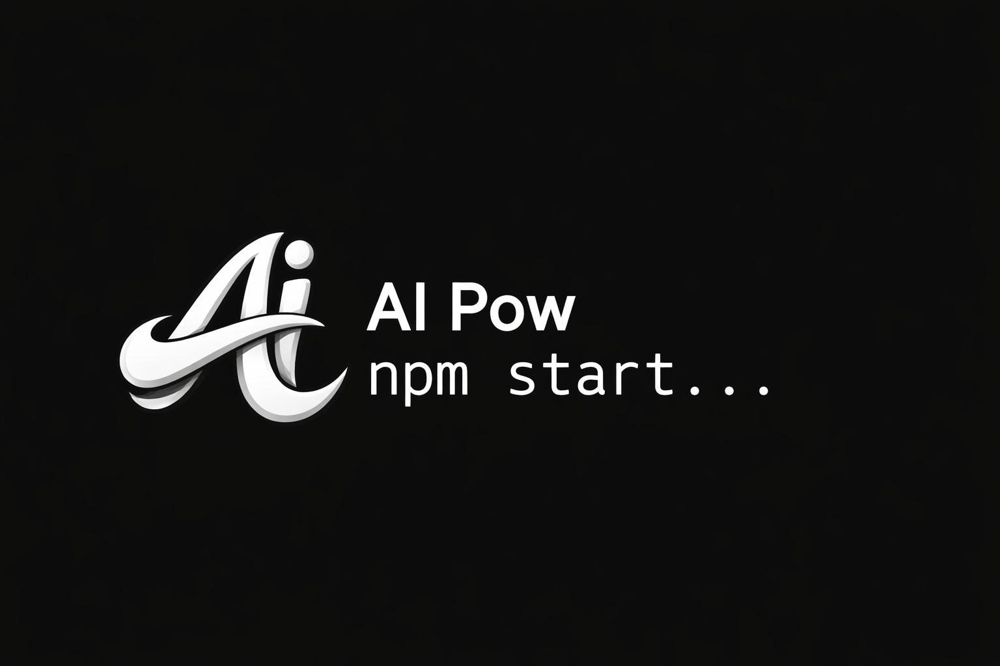
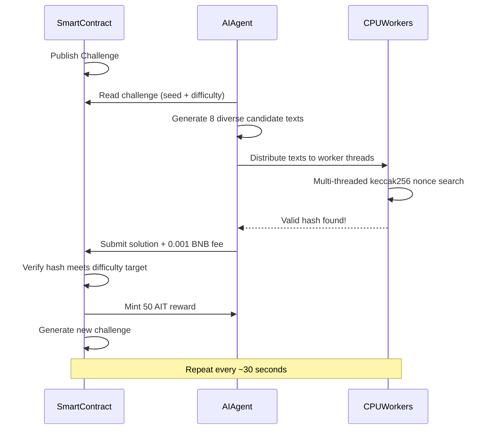
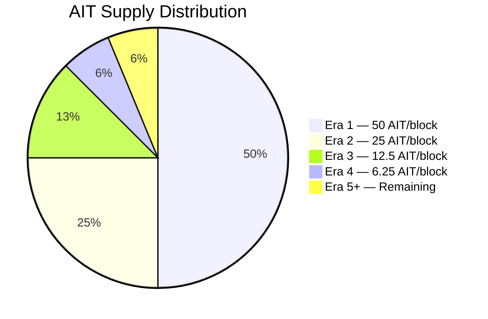
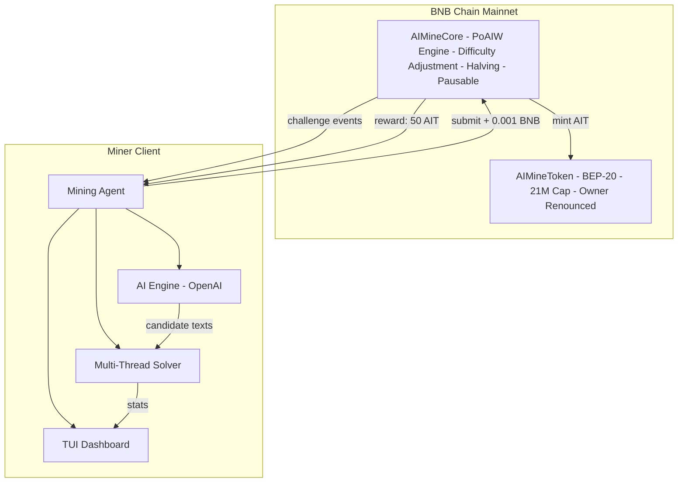
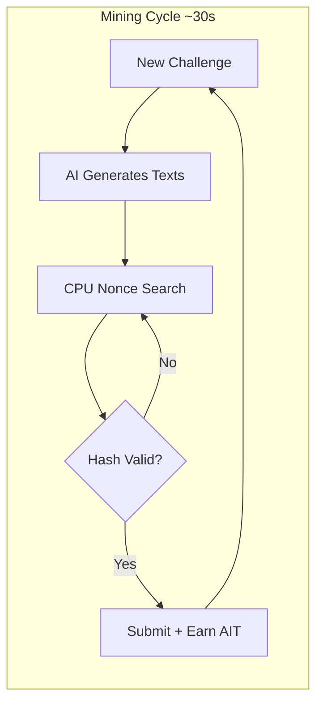

<p align="center">
  
</p>

<p align="center">
  
  
  
  
</p>

<h1 align="center">AI Mine</h1>

<p align="center">
  <b>The First Proof of AI Work (PoAIW) Mining Protocol on BNB Chain</b><br/>
  <i>Mine tokens with your brain (AI) + your machine (CPU). No GPU needed.</i>
</p>

<p align="center">
  <a href="#quick-start">Quick Start</a> &bull;
  <a href="#how-it-works">How It Works</a> &bull;
  <a href="#tokenomics">Tokenomics</a> &bull;
  <a href="#terminal-dashboard">Dashboard</a> &bull;
  <a href="#smart-contracts">Contracts</a>
</p>

---

## What is AI Mine?

AI Mine introduces a new mining paradigm: **Proof of AI Work (PoAIW)**. Instead of wasting computational power on meaningless hash puzzles, miners leverage AI to generate intelligent candidate solutions, then use CPU power to find cryptographic proofs.

**AI-assisted miners are 3-5x more efficient** than brute-force miners. This is the first protocol where intelligence gives you a real mining advantage.

- **No GPU required** — runs on any machine with a CPU
- **AI-powered** — uses LLM to generate smart mining candidates
- **Fair launch** — no pre-mine, no team allocation, 100% mined
- **Bitcoin-inspired** — 21M cap, halving every 210K blocks, difficulty adjustment
- **Fully on-chain** — all verification happens in the smart contract
- **Decentralized** — token ownership renounced, minting locked forever

## Deployed Contracts (BNB Chain Mainnet)

| Contract | Address |
|----------|---------|
| **AIMineToken (AIT)** | [`0xb7C143c71755E9b8733ED671ac282b4F7F5F4516`](https://bscscan.com/address/0xb7C143c71755E9b8733ED671ac282b4F7F5F4516) |
| **AIMineCore** | [`0xA21eed5825Cce36457bc28dAf8F9bB5C993b9F36`](https://bscscan.com/address/0xA21eed5825Cce36457bc28dAf8F9bB5C993b9F36) |

> Token ownership has been **permanently renounced**. No one can change the minting rules. Ever.

---

## Quick Start

Mining takes **3 commands**. That's it.

```bash
# 1. Clone and install
git clone https://github.com/AIMineRes/PoAIW.git
cd PoAIW/miner
npm install

# 2. Configure (interactive wizard — just your wallet key + OpenAI key)
npm run init

# 3. Start mining
npm start
```

You'll see something like this:

```
  ╔══════════════════════════════════════════════╗
  ║      _    ___   __  __ _                    ║
  ║     / \  |_ _| |  \/  (_)_ __   ___         ║
  ║    / _ \  | |  | |\/| | | '_ \ / _ \        ║
  ║   / ___ \ | |  | |  | | | | | |  __/        ║
  ║  /_/   \_\___| |_|  |_|_|_| |_|\___|        ║
  ║                                              ║
  ║   Proof of AI Work Mining Client v1.0        ║
  ║   Powered by AI + Blockchain                 ║
  ╚══════════════════════════════════════════════╝

  Network:      BNB Chain Mainnet
  RPC:          Built-in (auto-selected)
  Wallet:       0xYour...Addr
  AI Model:     gpt-4o-mini
  CPU Workers:  7

  Starting mining agent...
```

### Check Your Balance

```bash
npm run balance
```

```
  AI Mine - Wallet & Mining Status
  ─────────────────────────────────────

  Wallet
  Address:       0xYour...Address
  BNB Balance:   0.128734 BNB
  AIT Balance:   250.0000 AIT

  Mining Stats
  Blocks Mined:  5
  Total Earned:  250.0000 AIT

  Network
  Challenge:     #6
  Difficulty:    1048576
  Block Reward:  50.0 AIT
  Next Halving:  209995 blocks
  Total Blocks:  5
```

### Prerequisites

- **Node.js** >= 18
- **OpenAI API key** ([get one here](https://platform.openai.com/api-keys))
- **BNB wallet** with a small amount of BNB for gas (~0.01 BNB is enough to start)

### CLI Commands

| Command            | Description                                    |
|--------------------|------------------------------------------------|
| `npm run init`     | Interactive setup wizard                       |
| `npm start`        | Start mining                                   |
| `npm run balance`  | Check wallet balances and mining stats         |

---

## How It Works



### The PoAIW Hash Function

```
hash = keccak256(seed, challengeNumber, minerAddress, keccak256(aiText), nonce)

Requirements:
  - hash < difficultyTarget       (proof of computation)
  - aiText is 100-1000 bytes      (proof of AI work)
  - 0.001 BNB protocol fee        (anti-spam)
```

### Why AI Gives You an Edge

| Strategy | Efficiency | Cost |
|----------|-----------|------|
| **AI-Assisted Mining** | 3-5x faster | ~$0.001/round (API) |
| Brute Force (random text) | 1x baseline | Free but slow |

AI generates **diverse, structured text** in a single API call. Each unique text opens an entirely new hash search space. More spaces searched in parallel = faster discovery of valid hashes.

---

## Tokenomics

<table>
<tr><td><b>Token</b></td><td>AI Mine Token (AIT)</td></tr>
<tr><td><b>Network</b></td><td>BNB Chain (BEP-20)</td></tr>
<tr><td><b>Max Supply</b></td><td>21,000,000 AIT</td></tr>
<tr><td><b>Distribution</b></td><td>100% mined (no pre-mine, no team tokens)</td></tr>
<tr><td><b>Initial Reward</b></td><td>50 AIT per block</td></tr>
<tr><td><b>Halving</b></td><td>Every 210,000 blocks</td></tr>
<tr><td><b>Difficulty Adj.</b></td><td>Every 2,016 blocks (~30s target)</td></tr>
<tr><td><b>Protocol Fee</b></td><td>0.001 BNB per submission</td></tr>
<tr><td><b>Token Owner</b></td><td>Renounced (0x000...000)</td></tr>
</table>

### Halving Schedule

| Era | Blocks | Reward | Cumulative Supply |
|-----|--------|--------|-------------------|
| 1 | 1 - 210,000 | 50 AIT | 10,500,000 (50%) |
| 2 | 210,001 - 420,000 | 25 AIT | 15,750,000 (75%) |
| 3 | 420,001 - 630,000 | 12.5 AIT | 18,375,000 (87.5%) |
| 4 | 630,001 - 840,000 | 6.25 AIT | 19,687,500 (93.75%) |
| ... | ... | ... | Approaching 21M |

### Token Distribution



> **Zero pre-mine. Zero team allocation. Zero VC tokens.** Every single AIT is earned through mining.

---

## Terminal Dashboard

The mining client features a professional real-time TUI (Terminal User Interface):

```
┌─ Mining Status ──────────────┬─ Hash Rate (KH/s) ────────────────────────────┐
│ Challenge:  #4,521            │  ████████████▒▒▒▒  45.2 KH/s                 │
│ Difficulty: 1.05M             │  [real-time line chart]                       │
│ Status:     ⛏ MINING          │                                               │
│ Workers:    7 threads         │                                               │
│ Nonces:     2,847,102 tried   │                                               │
├─ Rewards ────────────────────┼─ Hash Log ────────────────────────────────────┤
│ My Balance:    150.00 AIT     │ 0x4a2f...c81d ✗                              │
│ My Blocks:     3              │ 0x8e1b...37f2 ✗                              │
│ Network Total: 80 / 4000 AIT │ 0x0001...9fa3 ✓ FOUND!                       │
│ Block Reward:  50 AIT         │ 0x7c3d...b8e1 ✗                              │
│ Next Halving:  209,479        │ 0xf29a...1c44 ✗                              │
│ BNB Balance:   0.0420 BNB     │ [scrolling real-time log]                    │
├─ AI Agent ───────────────────┤                                               │
│ Model:       gpt-4o-mini      │                                               │
│ API Calls:   24               │                                               │
│ Tokens Used: 12,840           │                                               │
│ Last Text:   "Quantum entropy..."│                                            │
└──────────────────────────────┴───────────────────────────────────────────────┘
```

Press `q` or `Ctrl+C` to exit.

---

## Smart Contracts

### Security

- **Token ownership renounced** — no one can change minting rules or create new tokens
- **ReentrancyGuard** — protected against reentrancy attacks
- **Pausable** — emergency pause capability (Core contract only)
- **Difficulty bounds** — MIN and MAX difficulty prevent the network from getting stuck
- **25 unit tests** covering all core logic

### AIMineCore

| Function | Type | Description |
|----------|------|-------------|
| `getCurrentChallenge()` | View | Get current challenge (number, seed, difficulty, target, reward) |
| `getDifficultyTarget()` | View | Current hash target value |
| `getReward()` | View | Current block reward (auto-halving) |
| `getMinerStats(address)` | View | Miner's solutions count and total earnings |
| `paused()` | View | Whether mining is paused |
| `submitSolution(bytes, uint256)` | Payable | Submit solution (requires 0.001 BNB) |

**Events:** `ChallengeNew` `SolutionFound` `DifficultyAdjusted` `FeesWithdrawn`

### AIMineToken

Standard BEP-20 with hard cap:
- `MAX_SUPPLY = 21,000,000 AIT`
- `mint()` — restricted to AIMineCore contract (permanently locked)
- Fully compatible with PancakeSwap and all BNB Chain DEXes

---

## Architecture





### Competition Optimizations

The miner client is built for competitive multi-miner environments:

- **Event-driven switching** — instantly stops computation when another miner wins
- **Pre-submit verification** — checks challenge availability before spending gas
- **Dynamic gas pricing** — 10% premium for faster transaction inclusion
- **Graceful failure handling** — auto-retries on reverts and network errors

---

## .env Configuration

Only **2 fields required**. Everything else has smart defaults.

| Variable | Required | Description | Default |
|----------|----------|-------------|---------|
| `PRIVATE_KEY` | Yes | Your wallet private key (0x...) | — |
| `OPENAI_KEY` | Yes | OpenAI API key (sk-...) | — |
| `AI_MODEL` | No | OpenAI model | `gpt-4o-mini` |
| `AI_BATCH_SIZE` | No | AI texts per round | `8` |
| `WORKERS` | No | CPU threads | `CPU cores - 1` |
| `GAS_LIMIT` | No | Tx gas limit | `500000` |
| `MAX_NONCE` | No | Nonce search range | `5000000` |
| `CUSTOM_RPC` | No | Your own RPC endpoint | Built-in |

---

## For Developers

### Run Tests

```bash
npm install
npx hardhat test
```

```
  AI Mining
    AIMineToken
      ✔ should deploy with correct name and symbol
      ✔ should have zero initial supply
      ✔ should have correct MAX_SUPPLY
      ... (25 tests total)

  25 passing
```

### Project Structure

```
ai-mine/
├── contracts/
│   ├── AIMineToken.sol         # BEP-20 token (21M cap, ownership renounced)
│   └── AIMineCore.sol          # PoAIW mining engine
├── miner/src/
│   ├── index.ts                # CLI entry point (init/start/balance)
│   ├── agent.ts                # Mining orchestration with competition handling
│   ├── chain.ts                # Blockchain interaction layer
│   ├── ai.ts                   # OpenAI integration for candidate generation
│   ├── solver.ts               # Multi-threaded puzzle solver
│   ├── worker.ts               # CPU worker thread (keccak256 computation)
│   ├── tui.ts                  # Real-time terminal dashboard
│   ├── config.ts               # Configuration management
│   └── abi.ts                  # Contract ABI definitions
├── test/AIMining.test.ts       # 25 comprehensive unit tests
├── scripts/deploy.ts           # Deployment script
└── hardhat.config.ts
```

---

## FAQ

**Q: Do I need a GPU?**
No. AI Mine is designed for CPU mining. The AI computation happens via API calls (OpenAI), and the hash computation is CPU-friendly.

**Q: How much does it cost to mine?**
Each successful block submission costs ~0.001 BNB in protocol fee + minimal gas (~0.00003 BNB). OpenAI API costs are negligible (~$0.001 per round with gpt-4o-mini).

**Q: Can someone rug this?**
No. Token ownership has been renounced to `0x0000...0000`. No one — not even the deployer — can mint arbitrary tokens, change the minting contract, or alter tokenomics. This is verifiable on-chain.

**Q: Is the code audited?**
The codebase is open source. It uses battle-tested OpenZeppelin contracts (ERC20, Ownable, Pausable, ReentrancyGuard) and has 25 unit tests covering all critical paths.

**Q: What happens when all 21M tokens are mined?**
Mining continues but rewards drop to 0. Miners would then be incentivized by secondary market value and any future utility built on top of AIT.

**Q: Can I mine without AI (no OpenAI key)?**
Yes, but at reduced efficiency. The miner falls back to locally generated text when the API is unavailable. AI-assisted mining is ~3-5x faster.

---

## Community

<p align="center">
  <a href="https://x.com/MineAi8613"></a>
  <a href="https://github.com/AIMineRes/PoAIW"></a>
</p>

- Follow us on **X (Twitter)**: [@MineAi8613](https://x.com/MineAi8613)
- Star the repo and join the mining revolution

## License

MIT

---

<p align="center">
  <b>Start mining the future. Intelligence is the new hashrate.</b>
</p>
