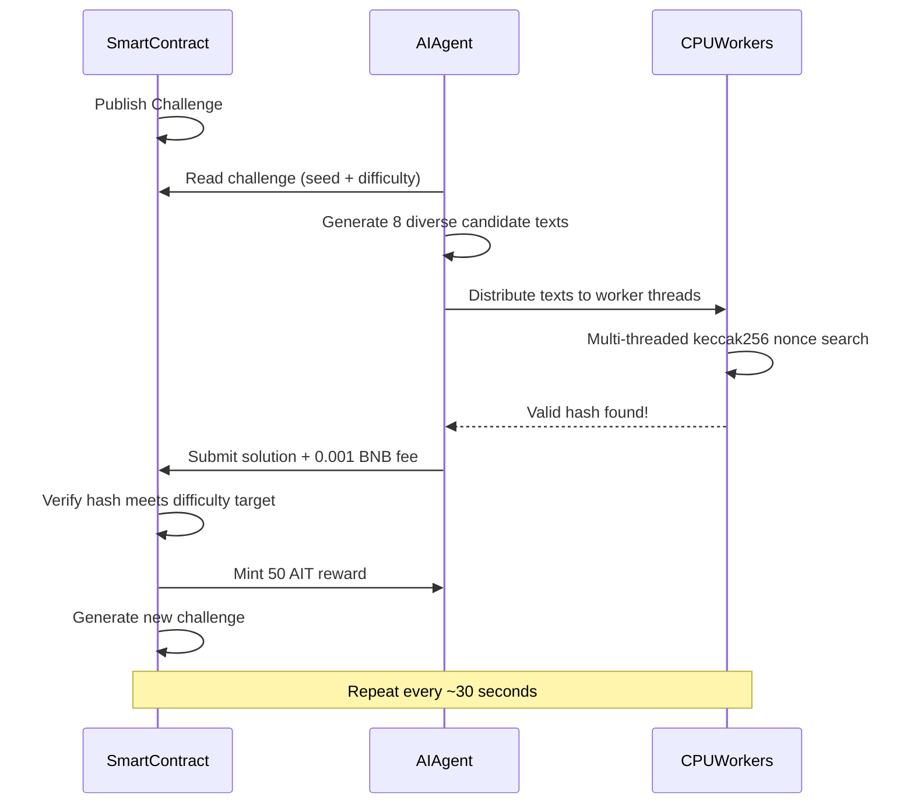

<p align="center">
  
</p>

<p align="center">
  
  
  
  
</p>

<h1 align="center">AI Mine</h1>

<p align="center">
  <b>BNB Chain 上首个 AI 工作量证明 (PoAIW) 挖矿协议</b><br/>
  <i>用你的大脑 (AI) + 你的机器 (CPU) 挖矿。无需 GPU。</i>
</p>

<p align="center">
  <a href="#quick-start">快速开始</a> &bull;
  <a href="#mine-with-openclaw">OpenClaw</a> &bull;
  <a href="#how-it-works">工作原理</a> &bull;
  <a href="#tokenomics">代币经济</a> &bull;
  <a href="#terminal-dashboard">终端面板</a> &bull;
  <a href="#smart-contracts">智能合约</a>
</p>

---

## 什么是 AI Mine？

AI Mine 引入了一种新的挖矿范式：**AI 工作量证明 (PoAIW)**。矿工不再把算力浪费在无意义的哈希谜题上，而是用 AI 生成智能候选解，再用 CPU 完成密码学验证。

**AI 辅助挖矿效率比纯暴力高 3–5 倍**，是首个「智力即算力」的协议。

- **无需 GPU** — 任何有 CPU 的机器即可运行
- **AI 驱动** — 使用大模型生成挖矿候选文本
- **公平启动** — 无预挖、无团队预留，100% 挖矿产出
- **类比特币** — 2100 万上限，每 21 万区块减半，难度可调
- **全链上** — 验证逻辑全部在智能合约中
- **去中心化** — 代币权限已放弃，铸造规则永久锁定

## 已部署合约 (BNB Chain 主网)

| 合约 | 地址 |
|----------|---------|
| **AIMineToken (AIT)** | [`0xb7C143c71755E9b8733ED671ac282b4F7F5F4516`](https://bscscan.com/address/0xb7C143c71755E9b8733ED671ac282b4F7F5F4516) |
| **AIMineCore** | [`0xA21eed5825Cce36457bc28dAf8F9bB5C993b9F36`](https://bscscan.com/address/0xA21eed5825Cce36457bc28dAf8F9bB5C993b9F36) |

> 代币所有权已**永久放弃**。无人可再修改铸造规则。

---

## 快速开始

只需 **3 条命令**。

```bash
# 1. 克隆并安装
git clone https://github.com/AIMineRes/PoAIW.git
cd PoAIW/miner
npm install

# 2. 配置（交互式向导，只需钱包私钥 + OpenAI key）
npm run init

# 3. 开始挖矿
npm start
```

### 查看余额

```bash
npm run balance
```

### 前置要求

- **Node.js** >= 18
- **OpenAI API key**（[在此获取](https://platform.openai.com/api-keys)）
- **BNB 钱包**，含少量 BNB 作 gas（约 0.01 BNB 即可起步）

### 方式 A：终端挖矿 (CLI)

| 命令 | 说明 |
|--------------------|------------------------------------------------|
| `npm run init` | 交互式配置向导 |
| `npm start` | 开始挖矿（终端面板） |
| `npm run balance` | 查看钱包与挖矿统计 |

### 方式 B：网页挖矿 (浏览器)

```bash
# 1. 克隆安装（同方式 A）
git clone https://github.com/AIMineRes/PoAIW.git
cd PoAIW/miner
npm install

# 2. 启动网页服务
npm run web

# 3. 浏览器打开 http://localhost:3000
# 4. 在表单中填写钱包私钥与 OpenAI API key
# 5. 点击 "START MINING"
# 6. 在页面查看实时挖矿统计
# 7. 完成后点击 "STOP MINING"
```

### 方式 C：用 OpenClaw 挖矿

通过 [OpenClaw](https://github.com/openclaw/openclaw) 完成安装、配置与启停，无需终端或手动改文件。安装 aimine skill 后用自然语言（英文）即可。

| 你想做的事 | 示例 |
|---------------|---------|
| 安装矿工 | "install AIT mining" |
| 配置 | "configure AIT mining" |
| 开始挖矿 | "start mining" |
| 停止挖矿 | "stop mining" |
| 状态 | "mining status" |
| 余额 | "AIT balance" |

**1. 安装 aimine skill（一次性）** — 在 [ClawHub](https://clawhub.ai/nancyuahon/aimine) 安装：`npx clawhub@latest install nancyuahon/aimine`。或把 `openclaw-skill-aimine` 复制到 `~/.openclaw/skills/`。  
**2. 在 OpenClaw 中设置密钥**：`PRIVATE_KEY` 与 `OPENAI_KEY`（或 `OPENAI_API_KEY`）。或在对话中说「configure mining」时提供。若出现 invalid API key，请用 `OPENAI_API_KEY` 或确保 key 无多余空格且以 `sk-` 开头。  
**3. 在 OpenClaw 中说**上表中的英文短语即可。矿工目录默认 `~/PoAIW`，可用 `AIMINE_DIR` 覆盖。

---

## 工作原理



### PoAIW 哈希函数

```
hash = keccak256(seed, challengeNumber, minerAddress, keccak256(aiText), nonce)

要求：
  - hash < difficultyTarget       （算力证明）
  - aiText 为 100–1000 字节       （AI 工作证明）
  - 每次提交 0.001 BNB 协议费     （防滥用）
```

### 为什么 AI 更有优势

| 策略 | 效率 | 成本 |
|----------|-----------|------|
| **AI 辅助挖矿** | 约 3–5 倍更快 | 约 $0.001/轮 (API) |
| 暴力（随机文本） | 1x 基准 | 免费但慢 |

AI 一次调用即可生成**多样、结构化**文本，每个文本对应一个新的哈希搜索空间。并行搜索的空间越多，越容易找到合法哈希。

---

## 代币经济

<table>
<tr><td><b>代币</b></td><td>AI Mine Token (AIT)</td></tr>
<tr><td><b>网络</b></td><td>BNB Chain (BEP-20)</td></tr>
<tr><td><b>最大供应</b></td><td>21,000,000 AIT</td></tr>
<tr><td><b>分配</b></td><td>100% 挖矿产出（无预挖、无团队代币）</td></tr>
<tr><td><b>初始奖励</b></td><td>每区块 50 AIT</td></tr>
<tr><td><b>减半</b></td><td>每 210,000 区块</td></tr>
<tr><td><b>难度调整</b></td><td>每 2,016 区块（目标约 30 秒）</td></tr>
<tr><td><b>协议费</b></td><td>每次提交 0.001 BNB</td></tr>
<tr><td><b>代币归属</b></td><td>已放弃 (0x000...000)</td></tr>
</table>

> **零预挖。零团队预留。零 VC 代币。** 每一枚 AIT 都通过挖矿获得。

---

## 终端面板

挖矿客户端提供实时 TUI 面板，显示难度、算力、奖励与 AI 调用等。

按 `q` 或 `Ctrl+C` 退出。

---

## 智能合约

### 安全

- **代币权限已放弃** — 无人可改铸造规则或增发
- **ReentrancyGuard** — 防重入
- **Pausable** — 仅核心合约可紧急暂停
- **难度上下限** — 防止网络卡死
- **25 个单元测试** 覆盖核心逻辑

### AIMineCore

| 函数 | 类型 | 说明 |
|----------|------|-------------|
| `getCurrentChallenge()` | View | 当前挑战（编号、种子、难度、目标、奖励） |
| `getDifficultyTarget()` | View | 当前哈希目标值 |
| `getReward()` | View | 当前区块奖励（自动减半） |
| `getMinerStats(address)` | View | 矿工解题数与总收益 |
| `paused()` | View | 是否暂停 |
| `submitSolution(bytes, uint256)` | Payable | 提交解（需 0.001 BNB） |

**事件:** `ChallengeNew` `SolutionFound` `DifficultyAdjusted` `FeesWithdrawn`

### AIMineToken

标准 BEP-20，硬顶 21,000,000 AIT，`mint()` 仅限 AIMineCore 调用（已永久锁定），兼容 PancakeSwap 等 BNB Chain DEX。

---

## .env 配置

只需配置 **2 项**，其余有合理默认值。

| 变量 | 必填 | 说明 | 默认 |
|----------|----------|-------------|---------|
| `PRIVATE_KEY` | 是 | 钱包私钥 (0x...) | — |
| `OPENAI_KEY` | 是 | OpenAI API key (sk-...) | — |
| `AI_MODEL` | 否 | OpenAI 模型 | `gpt-4o-mini` |
| `WORKERS` | 否 | CPU 线程数 | 核心数 - 1 |
| `CUSTOM_RPC` | 否 | 自定义 RPC | 内置 |

---

## 常见问题

**Q: 需要 GPU 吗？**  
不需要。AI Mine 为 CPU 挖矿设计，AI 部分通过 API（OpenAI）完成，哈希计算在 CPU 上即可。

**Q: 挖矿成本多少？**  
每次成功提交约 0.001 BNB 协议费 + 少量 gas（约 0.00003 BNB）。OpenAI API 成本很低（gpt-4o-mini 约 $0.001/轮）。

**Q: 会不会被 rug？**  
不会。代币所有权已放弃至 `0x0000...0000`，无人能随意铸造或修改规则，链上可查。

**Q: 没有 OpenAI key 能挖吗？**  
可以，但效率较低。无 API 时矿工会用本地生成的文本兜底。AI 辅助挖矿约快 3–5 倍。

---

## 社区

<p align="center">
  <a href="https://x.com/MineAi8613"></a>
  <a href="https://github.com/AIMineRes/PoAIW"></a>
</p>

- **X (Twitter)**: [@MineAi8613](https://x.com/MineAi8613)
- 给仓库点 Star，一起参与挖矿

## 许可证

MIT

---

<p align="center">
  <b>挖向未来。智力即新算力。</b>
</p>
